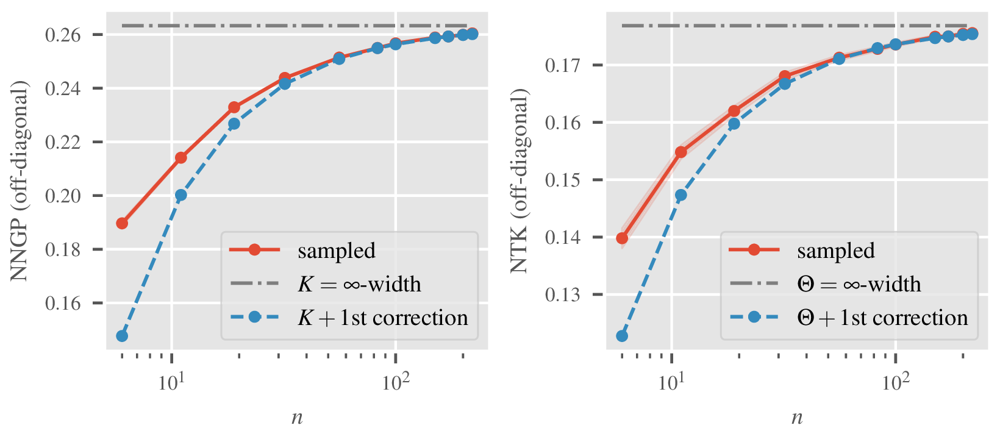

# NTK-Unlimited

[ICML 2026 paper](https://openreview.net/pdf?id=SOlPHMdSY3)
| [arXiv version](https://arxiv.org/abs/2508.11522)

## Overview

`ntkunlimited` is a package to compute finite-width corrections to the infinite-width limit of the [neural tangent kernel](https://proceedings.neurips.cc/paper/2018/hash/5a4be1fa34e62bb8a6ec6b91d2462f5a-Abstract.html) (NTK) and other statistical tensors involving the NTK and preactivations of a neural networks for the multi-input case. It was developed as part of the [*Finite-Width Neural Tangent Kernels from Feynman Diagrams*](https://openreview.net/pdf?id=SOlPHMdSY3) paper, published at the *ICML 2026*.



The  NTK is a popular tool to study the training dynamics of neural networks. In the limit of infinitely wide hidden layers, it is analytically tractable. The most prominent implementation of these analytical computations, the [`neural-tangents`](https://github.com/google/neural-tangents) package, has been widely adopted in the literature. More recently, finite-width corrections have been derived to the NTK to overcome its fundamental drawbacks such as vanishing feature learning in the infinite-width limit. We follow the conventions of [The Principles of Deep Learning Theory](http://arxiv.org/abs/2106.10165).

The package consists of two parts
- a `recursions` package that solves the analytic closed system of recursions describing how the statistics evolve with network depth.
- an `empirical` package implementing sampling routines to estimate the same tensors at variable widths via Monte-Carlo

`ntkunlimited` implements all tensor recursions necessary to compute first order corrections to the infinite-width solutions of the NTK and the NNGP for both the single- and multi-input case for MLPs. It automatically resolves the dependency tree and provides a flexible framework based on [SymPy](https://docs.sympy.org/latest/index.html) to allow for straightforward extension to higher order recursions. Empirical sampling is heavily parallelized using [JAX](https://docs.jax.dev/en/latest/) and enables large sample sizes at moderate depths and widths.

## Installation

### Using `uv`

Run

```bash
uv sync --all-extras
```
or skip the flag if you don't want to install optional dependencies.

### Using `pip`

Run

```bash
pip install -e .
```


## Usage


### Computing analytical, corrected tensors

Located at `src/ntkunlimited/recursions/`, this package computes the requested, finite-width corrected tensor by solving the recursions for all dependent tensors layer by layer up to the specified depth.

To run a recursion study for the $$V$$ tensor, use e.g. the following command:
```bash
uv run recursions recursion-width-study --n_layers 3 --layer_widths 5,8,16 --C_w 1.98305826 --max_subdiv 10_000 --rtol 1e-3 --input_file examples/inputs/input_recursions.json V4
```

Since the Gaussian expectation values appearing in the recursions do not have an analytical solution for all common activation functions, they are computed using [*SciPy's* cubature](https://docs.scipy.org/doc/scipy/reference/generated/scipy.integrate.cubature.html). `max_subdiv` and `rtol` hence control the accuracy of the numerical approximation.

A complete list of available options can be seen by running
```bash
uv run recursions recursion-width-study --help
```

Results are written as JSON files to `tensors/` inside the current working directory (or inside `--output_dir` if specified), one file per tensor type and parameter combination. Each file accumulates results across multiple widths, so re-running with new `--layer_widths` extends the existing file rather than overwriting it.

### Estimating the empirical tensors via Monte-Carlo

The empirical package is located at `src/ntkunlimited/empirical/`. It initializes the specified MLP with i.i.d. centered normally distributed parameters using the given variances for weights and biases. The requested tensors are computed for each layer up to the last one and approximated by estimating the expectation values through sample means.

To estimate e.g. the NTK kernel (similarly for the NNGP), run
```bash
uv run tensor_convergence_all_layers kernel-stability ntk --trace --n_layers 3 --layer_width 5 --nonlin Gelu --C_w 1.98305826 --C_b 0.17292239 --data_size 4 --n_samples 10 --batch_size 5 --input_file examples/inputs/input_recursions.json --output_dir convergence_study
```

A more detailed explanation of the available options is obtained via
```bash
uv run tensor_convergence_all_layers kernel-stability --help
```

To estimate one of the other tensors, use the `tensor-stability` command. For example, to compute the tensors `V4, D, F, A, B`, run
```bash
uv run tensor_convergence_all_layers tensor-stability V4 D F A B --n_layers 3 --layer_width 5 --nonlin Gelu --C_w 1.98305826 --C_b 0.17292239 --data_size 4 --n_samples 10 --batch_size 5 --input_file examples/inputs/input_recursions.json --output_dir convergence_study
```

Or to compute just a single tensor, for instance the $$V_4$$ tensor (connected 4-point function / fourth cumulant):
```bash
uv run tensor_convergence_all_layers tensor-stability V4 --n_layers 3 --layer_width 5 --nonlin Gelu --C_w 1.98305826 --C_b 0.17292239 --data_size 4 --n_samples 10 --batch_size 5 --input_file examples/inputs/input_recursions.json --output_dir convergence_study
```

The main difference between `kernel-stability` and `tensor-stability` is the error estimation. While the former can deduce the variance of the estimator directly from the sample variance, the latter has to perform `n_samples_stats` repetitions of runs with `n_samples` samples to estimate the variance of the mean.

For more details, use the help flag
```bash
uv run tensor_convergence_all_layers tensor-stability --help
```

Results are written as JSON files to `tensors/` inside `--output_dir` (default: current directory), one file per tensor type. Each file contains the sample mean and variance of the Monte-Carlo estimates across all layers.


## Caching

Computed tensors and numerical integrals are cached to disk and reused on subsequent runs to speed up computation. While there are some basic checks in place that aim to avoid using results computed with different hyperparameters, this feature is still in development. If you changed any of the hyperparameters and suspect the results are wrong, use `--force-recompute` to overwrite the cache and recompute everything from scratch.

There is also another cache for the numerical functions that are created from the symbolic recursions. Those only depend on the `sympy` expressions themselves and don't need to be recomputed for different parameters, hence they are not overwritten by `--force-recompute`. Only if one changes the expressions of the recursions in the source code, the cache files need to be deleted manually.

The cache directory lives inside the package (`src/ntkunlimited/recursions/cache/`) and contains:
- lambdified numeric functions (`*_recursion_numeric_fn.pkl`)
- numerical integration results (`gaussexpec_numeric_cache.pkl`)

To delete the cache, use the `clear-cache` command:
```bash
uv run recursions clear-cache                              # clears internal cache/ only
uv run recursions clear-cache --tensor-dir tensors/        # also deletes tensor output files
```

## Output Format

Both modules write JSON files. All files contain a `meta` key with the hyperparameters used to produce the results.

**Analytical tensors** (`{output_dir}/tensors/`, filename: `{tensor}_analytic_{params}.json`):
```
{
  "meta": { "C_w": ..., "nonlin": ..., ... },
  "data": {
    "width-10": {
      "layer-1": { "0-0-0-0": 0.0, "0-0-0-1": 0.0, ... },
      "layer-2": { ... }
    },
    "width-32": { ... }
  }
}
```
Tensor components are stored as flat string keys `"i-j-k-l"`. Multiple widths accumulate in the same file.

**Empirical tensors** (`{output_dir}/tensors/`, filename: `{tensor}_{params}.json`):
```
{
  "meta": { "layer_width": ..., "nonlin": ..., ... },
  "mean": { ... },
  "var": { ... },
  "n_samples_stats": 100
}
```
`mean` and `var` are nested structures mirroring the tensor's layer-by-layer shape.

## Testing

To run the complete test suite, run
```bash
uv run pytest tests/
```

## Citation

If you use any parts of the code in a publication, please cite our paper
```bibtex
@inproceedings{
    guillen2026,
    title         = {Finite-{{Width Neural Tangent Kernels}} from {{Feynman Diagrams}}},
    author        =  {Guillen, Max and Misof, Philipp and Gerken, Jan E.},
    booktitle     = {Forty-third {{International Conference}} on {{Machine Learning}}},
    year          = 2026,
    month         = jul,
    eprint        = {2502.15376},
    archiveprefix = {arXiv},
    primaryclass  = {cs},
    url           = {https://openreview.net/forum?id=SOlPHMdSY3}
}
```
